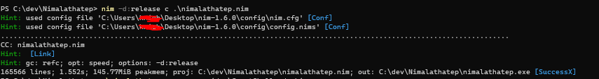
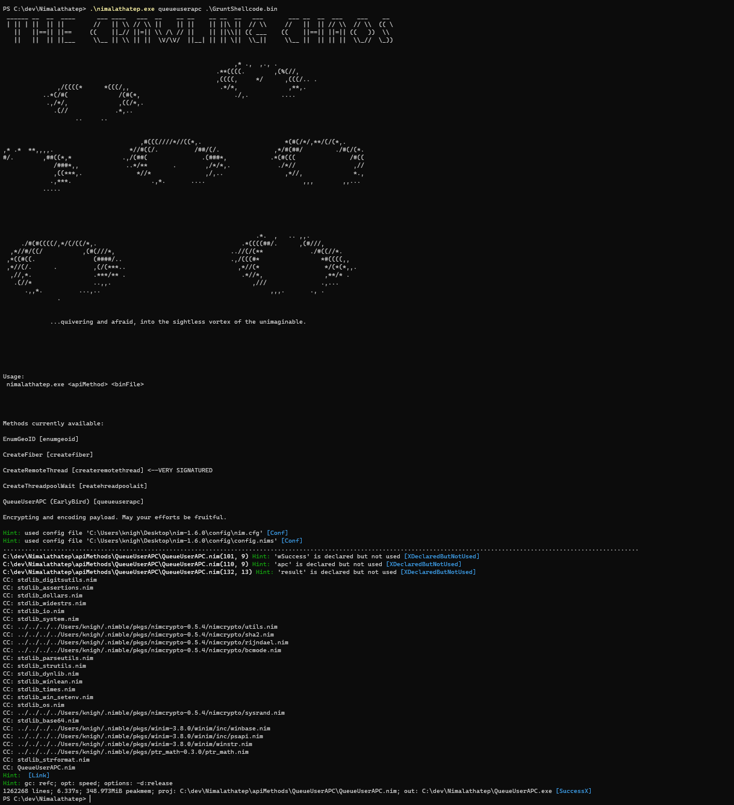
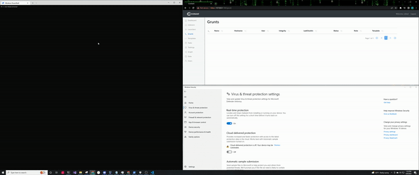

# Nimalathatep
Nimalathatep is a Nim shellcode payload generation project that aims to get a stealthy binary inro your hands quickly. All methods use well-known API-call sequences.

# Evasion
AV/EDR avoidance is performed through AES encryption followed by Base64, with the payload itself only being decrypted at runtime. The IV is currently static, but I aim to change this in the future. 

# Compilation
Ensure you have NIM downloaded from here: https://nim-lang.org/install.html </br>
</br>
To compile: </br>
```nim -d:release c .\nimalathatep.nim``` </br>
</br>
[]
</br>

# Usage
Limited functionality right now, but simply run the executable and pass it the API method and your raw shellcode file: </br> </br>
```.\nimalathatep.exe <apiMethod> <binFile>``` </br>
</br>

</br>

# Defender Check


# Known Issues
While compiling, Nimalathatep searches for a "REPLACE_ME" string. If you have to compile a payload twice, ensure to open up the template and replace the filled in shellcode (in shellcode_base64_encrypted) to the string. I'll fix this soon.

# To Do
-Add more API methods </br>
-Custom unhook stuff </br>
-Cooler things like Macros, HTAs, etc </br>

# Credits
Some code bits from: <br>
https://github.com/byt3bl33d3r/OffensiveNim </br>
https://www.ired.team/ </br>
https://github.com/bigb0sss/Bankai <--Initial inspiration

# Disclaimer
Only use this for purposes involving systems that you have been given permission to access and alter. I am not responsible if you do illegal stuff. 

